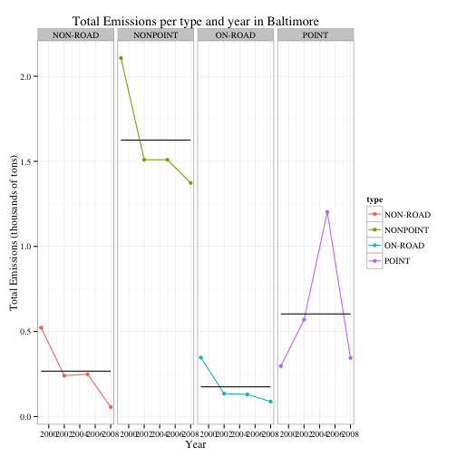
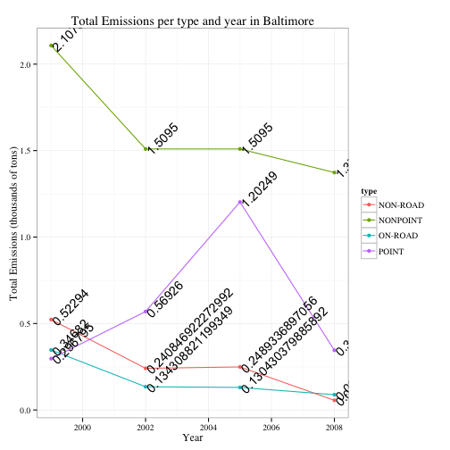

Data Products Development: Peer Assignment 1
========================================================
css: pa1.css

  
author: Miquel Corral  
date: August 09 2015

  

<h5>You can find the Shiny App <a href="https://miquel.shinyapps.io/shiny">here</a></h5>
<h6>It is mainly for the user play with plotting options.</h6>

Shiny App Design
========================================================

 The dataset used was the one used in the Peer Assignment 2 of previous course Exploratory Data Analysis. It contains data about pollutants in the US.

The interactions options are:

- Checkboxes group to:
  - Set a single plot or a sepparate plot for each pollutant source.
  - Show or not the mean values of the graphic.
  - Shor or not the text labels for each point in the graphic.
- Radio button to hide or show the legend of the graphic.
- Slider to set the size of the text labels.

Example of plotting (I)
========================================================
transition: rotate

Plotting options selected:

- Sepparate plot for each source of pollutant.
- Show mean line.
- Do not show text labels.
- Show the graphic legend.

***

 

Example of plotting (II)
========================================================
transition: rotate  

Plotting options selected:

- Single plot with all sources of pollutants.
- Do not show mean line.
- Show text labels.
- Show the graphic legend.
- Maximum text legend size

***

 

Conclusions
========================================================
transition: fade  

<h3>About the Shiny App:</h3>
- User interaction with plotting options.
- Simple server calculation to adjust text size scale.
  

<h3>About the Presentation:</h3>
- It is done with RPresenter (with a bit of hacking the default css styles).
- You can find the source code <a href = "https://github.com/miquel-corral/Data_Products_PA1.git">here</a>.
  

Special thanks to Andy Lions for the tutorial on <a href="http://rstudio-pubs-static.s3.amazonaws.com/27777_55697c3a476640caa0ad2099fe914ae5.html#/">CSS customizations for R presentations</a>
